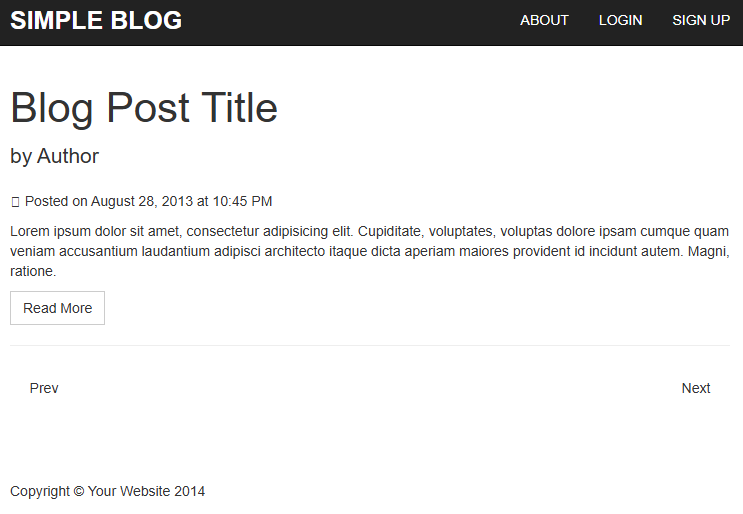

# 📁 Blog

Blog desarrollado integramente en php con control de acceso y gestion de usuarios, roles y posts

---

## 🛠️ Tecnologías utilizadas

- HTML5 / CSS3
- Javascript
- Bootstrap 5
- PHP
- Base de datos MySQL

---

## 📸 Capturas de pantalla

Puedes incluir aquí una o más imágenes del proyecto:



---

## ⚙️ Instalación y uso

1. Clone repository

```
git clone https://github.com/pablomil2000/blog.git
```

2. Entrar al directorio del proyecto

```
cd blog
```

3. Abrir editor de codigo

```
code .
```

### Database

Table Rols

| Colum | Use         |
| ----- | ----------- |
| Id    | Primary key |
| Name  | Common name |

Table Users

| Colum    | Use                                                           |
| -------- | ------------------------------------------------------------- |
| Id       | Primary key                                                   |
| Email    | Email para login                                              |
| Name     | Common name                                                   |
| Password | Contraseña                                                    |
| Status   | Comprobar si el usuario puede iniciar sesion o esta bloqueado |
| Role_id  | Clave externa con Rols                                        |
| Creation | Fecha creacion                                                |

Table Posts
| Colum | Use |
|----- |----- |
| Id | Primary key |
| Name | Titulo de los post |
| Creation |Fecha de creacion |
| Publish_at |Fecha de publicacion |
| Author_id |Clave externa Autor |
| Content |Contenido del post |
| Image |Imagen del post |

---

### 🧩 Roadmap

- Listado de posts
- Pagina de detalle del post
- Sistema de categorias y etiquetas
- Buscador de artículos
- Comentarios
- Crear, editar y eliminar posts
- Gestión de categorías y etiquetas
- Gestión de comentarios

---

### 📌 Notas

---

## 👨‍💻 Autor

**Tu Nombre**  
[🌐 Portfolio](https://pablo-martin-lopez.vercel.app/) · [🐱 GitHub](https://github.com/pablomil2000) · [💼 LinkedIn](https://linkedin.com/in/pablo-martin-lopez-17693717a)

---
